# Design Document: SWF Clicks Analysis Enhancements

## Overview

This design covers five enhancements across two workspaces:

**SWF workspace** (`scrabblewordsfinder/`):
1. **Map View** — Interactive Leaflet.js map on the Click Analysis admin page showing user locations from the ClicksAnalysis table
2. **Geo-Enrichment** — API endpoint to resolve IP addresses to lat/lng/city/country for ClicksAnalysis rows
3. **Contact API refactor** — Save-before-send pattern ensuring data persists before email attempt
4. **Suggest API refactor** — Save-before-send pattern, deprecating the legacy `suggestions` table

**Coins workspace** (`coins/`):
5. **Trend Color System** — Corrected `getTrendColor()` function with proper 5-tier sentiment-to-color mapping

## Architecture

```mermaid
graph TB
    subgraph "SWF Workspace (scrabblewordsfinder/)"
        subgraph "Admin UI"
            CA[clicks-analysis.astro]
            MapView[Map View Component<br/>Leaflet.js + MarkerCluster]
        end
        
        subgraph "API Layer"
            ClicksAPI[GET /api/clicks-analysis]
            GeoAPI[POST /api/geo-enrich]
            ContactAPI[POST /api/contact]
            SuggestAPI[POST /api/suggest]
        end
        
        subgraph "Data Layer"
            D1[(D1 Database)]
            EmailBinding[EMAIL Binding]
        end
        
        CA --> MapView
        MapView -->|fetch locations| ClicksAPI
        CA -->|trigger enrichment| GeoAPI
        GeoAPI -->|update lat/lng| D1
        ClicksAPI -->|read ClicksAnalysis| D1
        ContactAPI -->|save first| D1
        ContactAPI -->|then send| EmailBinding
        SuggestAPI -->|save first| D1
        SuggestAPI -->|then send| EmailBinding
    end
    
    subgraph "Coins Workspace (coins/)"
        CoinsAdmin[coins.astro / tracker.astro / analysis.astro]
        TrendColor[getTrendColor&#40;status, trend&#41;]
        CoinsAdmin --> TrendColor
    end
    
    subgraph "External"
        OSM[OpenStreetMap Tiles]
        GeoIPAPI[ip-api.com<br/>Free Geo-IP Lookup]
    end
    
    MapView -->|tile layer| OSM
    GeoAPI -->|batch resolve| GeoIPAPI
```



## Components and Interfaces

### 1. Map View Component (SWF)

**File:** `scrabblewordsfinder/src/pages/admin/clicks-analysis.astro`

The map view is added as a new view mode alongside the existing bubble chart views (By Element, By Page, By Country, By Device, By Browser). It uses Leaflet.js loaded via CDN with the MarkerCluster plugin.

**Dependencies (CDN):**
- `leaflet@1.9.4` — map rendering (CSS + JS)
- `leaflet.markercluster@1.5.3` — marker clustering (CSS + JS)

**Interface:**

```typescript
// Data fetched from /api/clicks-analysis endpoint
interface LocationData {
  ip_address: string;
  click_count: number;
  latitude: number;
  longitude: number;
  city: string;
  country: string;
  last_seen: string;
}

// Map initialization
function initMap(container: HTMLElement, locations: LocationData[]): L.Map;

// Filter valid locations (non-null, non-zero, valid ranges)
function filterValidLocations(locations: LocationData[]): LocationData[];

// Create markers with clustering
function createMarkers(map: L.Map, locations: LocationData[]): L.MarkerClusterGroup;
```

**View Switcher Integration:**
- New "Map View" button added to the existing `.flex.gap-2.mb-6` view switcher bar
- Data attribute: `data-view="map"`
- When active, hides the bubble container and shows the map container
- When switching away, destroys the map instance to free memory

### 2. Clicks Analysis API Endpoint (SWF)

**File:** `scrabblewordsfinder/src/pages/api/clicks-analysis.ts`

New endpoint that returns location data from the ClicksAnalysis table for the map view.

```typescript
// GET /api/clicks-analysis
// Returns all rows with valid lat/lng for map rendering
export const GET: APIRoute = async ({ request }) => {
  const db = (env as any).DB;
  const rows = await db.prepare(
    `SELECT ip_address, click_count, latitude, longitude, city, country, last_seen
     FROM ClicksAnalysis
     WHERE latitude IS NOT NULL AND longitude IS NOT NULL
       AND latitude != 0 AND longitude != 0
       AND latitude BETWEEN -90 AND 90
       AND longitude BETWEEN -180 AND 180`
  ).all();
  return json({ locations: rows.results });
};
```

### 3. Geo-Enrichment API Endpoint (SWF)

**File:** `scrabblewordsfinder/src/pages/api/geo-enrich.ts`

Admin-triggered endpoint that enriches un-enriched ClicksAnalysis rows with geo data. Uses the free `ip-api.com` batch endpoint (up to 100 IPs per request, 15 requests/minute for free tier).

```typescript
// POST /api/geo-enrich
// Enriches up to 50 un-enriched IPs per call
export const POST: APIRoute = async ({ request }) => {
  const db = (env as any).DB;
  
  // 1. Fetch up to 50 rows missing lat/lng
  const rows = await db.prepare(
    `SELECT id, ip_address FROM ClicksAnalysis
     WHERE latitude IS NULL AND ip_address != ''
     LIMIT 50`
  ).all();
  
  // 2. Filter out private/reserved IPs
  const publicIPs = rows.results.filter(r => !isPrivateIP(r.ip_address));
  
  // 3. Batch lookup via ip-api.com (POST /batch, max 100 per request)
  // 4. Update each row with resolved geo data
  // 5. Return summary { enriched: number, skipped: number, failed: number }
};

function isPrivateIP(ip: string): boolean;
```

**Private IP detection:**
- `127.x.x.x` — loopback
- `10.x.x.x` — private class A
- `192.168.x.x` — private class C
- `172.16.x.x` through `172.31.x.x` — private class B

**Rate limiting strategy:**
- Maximum 50 IPs per execution cycle
- 5-second timeout per individual IP lookup (for fallback single lookups)
- If batch fails, skip gracefully without affecting other rows

### 4. Contact API Refactor (SWF)

**File:** `scrabblewordsfinder/src/pages/api/contact.ts`

Refactored to implement save-before-send pattern. The current implementation tries to send email first and saves to DB as a secondary action — this inverts the order.

```typescript
export const POST: APIRoute = async ({ request }) => {
  // 1. Parse and validate input
  // 2. Check DB and EMAIL bindings (503 if neither available)
  // 3. Check message non-empty (400 if missing)
  // 4. INSERT into emails table FIRST
  // 5. Attempt email send (best-effort, wrapped in try/catch)
  // 6. If email fails, UPDATE emails row with error in comment field (truncated to 500 chars)
  // 7. Return 200 { ok: true } if DB save succeeded
  // 8. Return 500 { error: "..." } if DB save failed
};
```

**Key changes from current implementation:**
- DB save is the PRIMARY operation (not a fallback)
- Email send is SECONDARY and best-effort
- Remove the `suggestions` table fallback path
- Return 200 if DB save works, regardless of email outcome
- Store error details in `emails.comment` if email fails (truncated to 500 chars)
- Return 503 if neither DB nor EMAIL binding is available

### 5. Suggest API Refactor (SWF)

**File:** `scrabblewordsfinder/src/pages/api/suggest.ts`

Refactored to save to `emails` table first, removing the legacy `suggestions` table write entirely.

```typescript
export const POST: APIRoute = async ({ request }) => {
  // 1. Parse and validate input (suggestion field required, 400 if empty)
  // 2. Check DB binding available (500 if not)
  // 3. INSERT into emails table FIRST (category='suggest', subject='Feature Suggestion')
  // 4. Attempt email send (best-effort, wrapped in try/catch)
  // 5. If email fails, UPDATE emails row with error in comment field (truncated to 500 chars)
  // 6. Return 200 { ok: true } if DB save succeeded
  // 7. Return 500 { ok: false, error: "..." } if DB save failed
};
```

**Key changes from current implementation:**
- Remove `INSERT INTO suggestions` entirely
- `emails` table becomes the single source of truth
- Save-before-send pattern (DB first, email second)
- Error captured in `emails.comment` field (truncated to 500 chars)

### 6. Trend Color System (Coins workspace)

**Files:** `coins/src/pages/admin/coins.astro`, `coins/src/pages/admin/tracker.astro`, `coins/src/pages/admin/analysis.astro`

The current `getTrendColor()` function has incorrect sentiment mappings — "consolidating" maps to amber (negative-feeling) when it should be neutral gray, and the tiers don't follow a clear severity scale. The fix introduces a proper 5-tier scale.

```typescript
/**
 * Maps status/trend labels to sentiment colors.
 * 6-tier scale: dark red → red → orange → gray → green → bright green
 * Case-insensitive matching. Unknown values default to neutral gray.
 */
function getTrendColor(status: string, trend: string): string {
  const s = (status || '').toLowerCase();
  const t = (trend || '').toLowerCase();
  
  // Tier 1: Critical (dark red) — severe downturn
  const critical = ['crashing', 'dumping hard'];
  if (critical.includes(s) || critical.includes(t)) return '#991b1b';
  
  // Tier 2: Very Negative (red) — significant decline
  const veryNegative = ['bleeding', 'dumping'];
  if (veryNegative.includes(s) || veryNegative.includes(t)) return '#dc2626';
  
  // Tier 3: Negative (orange/amber) — moderate decline
  const negative = ['falling', 'declining', 'distributing', 'profit taking'];
  if (negative.includes(s) || negative.includes(t)) return '#f59e0b';
  
  // Tier 4: Neutral (gray/slate) — sideways movement
  const neutral = ['stable', 'sideways', 'consolidating'];
  if (neutral.includes(s) || neutral.includes(t)) return '#64748b';
  
  // Tier 5: Positive (green) — moderate gain
  const positive = ['rising', 'gaining', 'creeping up', 'accumulating'];
  if (positive.includes(s) || positive.includes(t)) return '#22c55e';
  
  // Tier 6: Very Positive (bright green/emerald) — strong gain
  const veryPositive = ['mooning', 'pumping hard', 'surging', 'pumping'];
  if (veryPositive.includes(s) || veryPositive.includes(t)) return '#10b981';
  
  // Default: neutral gray for unknown values
  return '#64748b';
}
```

**Key fixes from current implementation:**
- "consolidating" moves from amber → gray (it's neutral, not negative)
- "stable" and "sideways" added to neutral tier
- "falling", "declining" added as distinct from "dumping"
- "surging" added to very positive tier
- Clear 6-tier hierarchy instead of ad-hoc if/else matching
- Both `s` and `t` checked against each tier independently
- "dead cat bounce" removed (was using purple, doesn't fit sentiment scale — defaults to gray)

## Data Models

### ClicksAnalysis Table (existing — SWF)

```sql
CREATE TABLE ClicksAnalysis (
  id INTEGER PRIMARY KEY AUTOINCREMENT,
  ip_address TEXT NOT NULL,
  click_count INTEGER NOT NULL DEFAULT 0,
  latitude REAL DEFAULT NULL,
  longitude REAL DEFAULT NULL,
  city TEXT DEFAULT NULL,
  country TEXT DEFAULT NULL,
  last_seen TEXT DEFAULT (datetime('now'))
);
```

### Emails Table (existing — SWF)

```sql
CREATE TABLE emails (
  id INTEGER PRIMARY KEY AUTOINCREMENT,
  category TEXT NOT NULL DEFAULT 'contact',
  name TEXT DEFAULT '',
  email TEXT DEFAULT '',
  subject TEXT DEFAULT '',
  message TEXT DEFAULT '',
  ip_address TEXT DEFAULT '',
  comment TEXT DEFAULT '',
  read INTEGER NOT NULL DEFAULT 0,
  actioned INTEGER NOT NULL DEFAULT 0,
  date_actioned TEXT DEFAULT NULL,
  created_at TEXT NOT NULL DEFAULT (datetime('now'))
);
```

### Geo-IP Response Model (from ip-api.com batch endpoint)

```typescript
// POST http://ip-api.com/batch with JSON array of IPs
// Returns array of results
interface GeoIPResponse {
  status: 'success' | 'fail';
  query: string;        // The IP queried
  lat: number;          // Latitude (decimal, 4+ decimal places)
  lon: number;          // Longitude (decimal, 4+ decimal places)
  city: string;         // City name
  country: string;      // Country name
  message?: string;     // Error message on fail
}
```

### Map Marker Data (client-side)

```typescript
interface MapMarker {
  lat: number;
  lng: number;
  city: string;
  country: string;
  clickCount: number;
  lastSeen: string;     // YYYY-MM-DD formatted
}
```


## Correctness Properties

*A property is a characteristic or behavior that should hold true across all valid executions of a system — essentially, a formal statement about what the system should do. Properties serve as the bridge between human-readable specifications and machine-verifiable correctness guarantees.*

### Property 1: Valid locations produce markers, invalid locations do not

*For any* array of LocationData objects, the filterValidLocations function SHALL return only those entries where latitude is between -90 and 90, longitude is between -180 and 180, both are non-null, and both are non-zero. Each valid entry SHALL produce exactly one map marker at the correct coordinates.

**Validates: Requirements 1.2, 1.5**

### Property 2: Tooltip contains all required fields in correct format

*For any* LocationData object with non-null city, country, click_count, and last_seen values, the tooltip content builder SHALL produce a string containing the city name, country name, numeric click count, and last_seen date formatted as YYYY-MM-DD.

**Validates: Requirements 1.4**

### Property 3: Map bounds encompass all markers

*For any* non-empty set of valid latitude/longitude coordinates, the computed map bounds SHALL contain every coordinate point (i.e., for each point, bounds.contains(point) is true).

**Validates: Requirements 1.7**

### Property 4: Geo-enrichment failure isolation

*For any* batch of IP addresses where some lookups succeed and some fail, all successfully resolved IPs SHALL have their geo fields (latitude, longitude, city, country) updated, while failed IPs SHALL retain null geo fields. No exception from a single IP lookup SHALL prevent enrichment of remaining IPs.

**Validates: Requirements 2.3**

### Property 5: Private IP address detection

*For any* IP address matching the patterns 127.x.x.x, 10.x.x.x, 192.168.x.x, or 172.16.x.x through 172.31.x.x, the isPrivateIP function SHALL return true. *For any* IP address not matching these patterns (and with valid octets 0-255), it SHALL return false.

**Validates: Requirements 2.4**

### Property 6: Trend color tier mapping correctness

*For any* status or trend label belonging to a defined sentiment tier, the getTrendColor function SHALL return the hex color assigned to that tier: critical→'#991b1b', very negative→'#dc2626', negative→'#f59e0b', neutral→'#64748b', positive→'#22c55e', very positive→'#10b981'.

**Validates: Requirements 3.1, 3.2, 3.3, 3.4, 3.5, 3.6**

### Property 7: Trend color case insensitivity

*For any* valid sentiment label and *for any* case variation of that label (uppercase, lowercase, mixed case), the getTrendColor function SHALL return the same color value as the lowercase version.

**Validates: Requirements 3.7**

### Property 8: Unknown trend values default to neutral

*For any* string that does not match any defined sentiment label in any tier, the getTrendColor function SHALL return the neutral gray color '#64748b'.

**Validates: Requirements 3.9**

### Property 9: Contact API save-before-send with correct field mapping

*For any* valid contact form submission (non-empty message after trimming), the Contact_API SHALL insert a row into the emails table with category='contact', the mapped subject value, and the correct name, email, message, and ip_address fields BEFORE attempting email send.

**Validates: Requirements 4.1, 4.2**

### Property 10: Suggest API save-before-send with correct field mapping

*For any* valid suggestion submission (non-empty suggestion after trimming), the Suggest_API SHALL insert a row into the emails table with category='suggest', subject='Feature Suggestion', and the correct name, email, message, and ip_address fields BEFORE attempting email send.

**Validates: Requirements 5.1, 5.2**

### Property 11: Error message truncation in comment field

*For any* email send failure producing an error message of any length, the API SHALL store the error message in the emails table comment field, truncated to exactly 500 characters if the original exceeds that length, and stored in full otherwise.

**Validates: Requirements 4.3, 5.3**

### Property 12: Successful DB save returns 200 regardless of email outcome

*For any* valid form submission (contact or suggest) where the database INSERT succeeds, the API SHALL return HTTP 200 with `{ "ok": true }` in the response body, regardless of whether the subsequent email send succeeds or fails.

**Validates: Requirements 4.4, 5.4**

### Property 13: Empty/whitespace input validation returns 400

*For any* string composed entirely of whitespace characters (including empty string), submitting it as the message field to Contact_API or the suggestion field to Suggest_API SHALL return HTTP 400 with an appropriate error message, without writing to the database or attempting email send.

**Validates: Requirements 4.6, 5.6**

## Error Handling

### Map View
| Scenario | Handling |
|----------|----------|
| `/api/clicks-analysis` returns empty array | Show "No location data available" centered message in map container |
| `/api/clicks-analysis` fetch fails (network error) | Show error message in map container, log to console |
| Leaflet CDN fails to load | Gracefully degrade — map button shows "Map unavailable" on click |
| Invalid lat/lng in data | Filtered out by the SQL query and client-side validation before marker creation |

### Geo-Enrichment
| Scenario | Handling |
|----------|----------|
| ip-api.com returns error for an IP | Leave geo fields null for that IP, continue processing remaining IPs |
| ip-api.com batch request times out (>5s) | Abort batch, return partial results with count of processed vs skipped |
| ip-api.com rate limited (429) | Return error response indicating rate limit hit, suggest retrying later |
| Private/reserved IP encountered | Skip silently (leave null), increment `skipped` counter |
| DB update fails for one row | Log error, continue with next row, increment `failed` counter |
| No un-enriched rows found | Return `{ enriched: 0, skipped: 0, failed: 0, message: "All IPs already enriched" }` |

### Contact & Suggest APIs (save-before-send)
| Scenario | Handling |
|----------|----------|
| Invalid JSON body | Return 400 `{ error: "invalid JSON" }` |
| Empty/whitespace message/suggestion | Return 400 with field-specific error message |
| DB binding not available | Return 503 `{ error: "service unavailable" }` (contact) or 500 (suggest) |
| DB INSERT fails | Return 500 with error description, do NOT attempt email |
| Email send fails after DB save | UPDATE emails.comment with error (truncated to 500 chars), return 200 `{ ok: true }` |
| EMAIL binding not available | Skip email send silently, return 200 `{ ok: true }` (DB save is sufficient) |
| Email send timeout | Treat as email failure — capture error in comment field |

### Trend Color System
| Scenario | Handling |
|----------|----------|
| Null/undefined status or trend | Default to neutral gray '#64748b' |
| Unknown label | Default to neutral gray '#64748b' |
| Mixed case input | `.toLowerCase()` normalization before matching |
| Both status and trend provided | Check both against all tiers; first match wins (higher severity tiers checked first) |

## Testing Strategy

### Unit Tests (Example-based)

**Map View:**
- Map View button exists in view switcher bar
- Clicking Map View shows map container, hides bubble container
- Clicking another view hides map, shows bubbles
- Empty data shows "no location data" message
- MarkerCluster plugin is correctly initialized

**Geo-Enrichment:**
- Processing cap of 50 IPs per execution
- Batch endpoint called with correct payload format
- DB binding unavailable returns appropriate error

**Contact/Suggest APIs:**
- DB failure returns 500
- Missing bindings returns 503/500
- Valid submission with email success returns 200
- Valid submission with email failure returns 200 (DB saved)

**Trend Colors:**
- All three Coins admin pages contain identical getTrendColor function
- "dead cat bounce" (removed from tiers) defaults to gray

### Property-Based Tests

**Library:** `fast-check` (JavaScript property-based testing library)
**Minimum iterations:** 100 per property test

Each property test references its design document property number:

| Property | Test File | What's Generated |
|----------|-----------|-----------------|
| P1: Location filtering | `tests/map-view.property.test.ts` | Random lat/lng values (valid, invalid, edge cases like ±90, ±180, 0, null) |
| P2: Tooltip content | `tests/map-view.property.test.ts` | Random LocationData with various city/country strings, click counts, dates |
| P3: Map bounds | `tests/map-view.property.test.ts` | Random arrays of coordinate pairs |
| P4: Failure isolation | `tests/geo-enrich.property.test.ts` | Random arrays of IPs with random success/fail outcomes |
| P5: Private IP detection | `tests/geo-enrich.property.test.ts` | Random IPs across private and public ranges |
| P6: Tier mapping | `tests/trend-color.property.test.ts` | Random selection from defined tier labels, verify correct color |
| P7: Case insensitivity | `tests/trend-color.property.test.ts` | Random case variations of valid labels |
| P8: Unknown defaults | `tests/trend-color.property.test.ts` | Random strings NOT in any tier |
| P9: Contact field mapping | `tests/contact-api.property.test.ts` | Random valid form data (names, emails, subjects, messages) |
| P10: Suggest field mapping | `tests/suggest-api.property.test.ts` | Random valid suggestion data |
| P11: Error truncation | `tests/api-shared.property.test.ts` | Random error message strings of length 0 to 2000 |
| P12: Success response | `tests/api-shared.property.test.ts` | Random valid inputs with mocked DB success + random email outcomes |
| P13: Whitespace validation | `tests/api-shared.property.test.ts` | Random whitespace-only strings (spaces, tabs, newlines, mixed) |

**Tag format for each test:**
```typescript
// Feature: swf-clicks-analysis-enhancements, Property 5: Private IP detection
// For any IP matching private ranges, isPrivateIP returns true
```

### Integration Tests

- Geo-enrichment against real ip-api.com with 2-3 known IPs (verify lat/lng precision)
- Contact form end-to-end: submit → verify DB row exists → verify email received (post-deploy only)
- Suggest form end-to-end: submit → verify DB row in emails table → verify NO row in suggestions table

### Playwright UI Tests

- Map View toggle: show/hide map container
- Map markers render for seeded location data
- Tooltip displays on marker hover
- View switcher correctly toggles between all views
- Trend colors render correctly on coins admin pages
