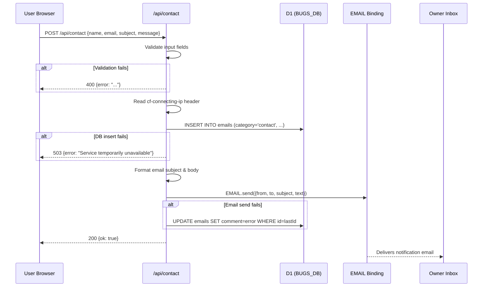
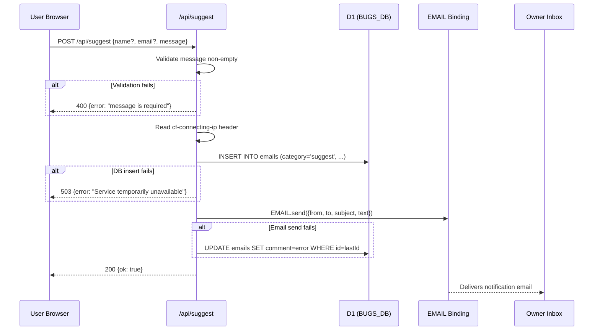
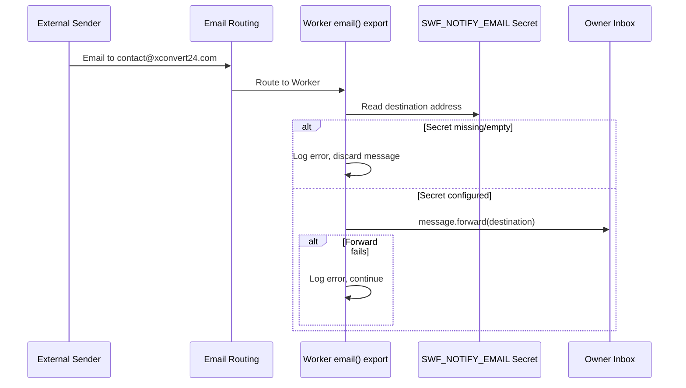

# Design Document: xConvert Email Integration

## Overview

This design integrates Cloudflare Email Service into xConvert24.com, providing two capabilities: (1) inbound email forwarding via the Worker `email()` export—routing messages sent to contact@, support@, and info@xconvert24.com to the site owner's notification address—and (2) outbound transactional email sending via the `EMAIL` (send_email) binding, triggered by form submissions on the Contact and Suggest pages.

The architecture follows a "save-first, email-best-effort" pattern: every form submission is persisted to the D1 `emails` table before any email send attempt. If email delivery fails, the user still receives a success response and the failure is logged to the record's `comment` field. The destination email address is stored exclusively as a Worker secret (`SWF_NOTIFY_EMAIL`), never hardcoded.

## Architecture

```mermaid
graph TD
    subgraph "Cloudflare Edge"
        ER[Email Routing Rules<br/>contact@, support@, info@]
        W[xConvert24 Worker]
        D1[(D1: BUGS_DB<br/>emails table)]
        SE[EMAIL Binding<br/>send_email]
        SEC[SWF_NOTIFY_EMAIL<br/>Worker Secret]
    end

    subgraph "Client"
        CF[Contact Form<br/>/contact]
        SF[Suggest Form<br/>/suggest]
    end

    subgraph "External"
        INBOX[Owner Inbox]
        SENDER[External Sender]
    end

    CF -->|POST /api/contact| W
    SF -->|POST /api/suggest| W
    W -->|INSERT| D1
    W -->|send via| SE
    SE -->|delivers to| INBOX
    W -->|reads| SEC

    SENDER -->|email to *@xconvert24.com| ER
    ER -->|routes to| W
    W -->|email&#40;&#41; export forwards| INBOX
```



## Sequence Diagrams

### Outbound: Contact Form Submission



### Outbound: Suggest Form Submission



### Inbound: Email Forwarding



## Components and Interfaces

### Component 1: Wrangler Configuration (send_email + email_routing)

**Purpose**: Declare the EMAIL binding and inbound email routing rules across all environments.

**Interface** (additions to each wrangler config):

```typescript
// Type representing the wrangler.jsonc additions
interface WranglerEmailConfig {
  send_email: Array<{
    name: "EMAIL";                    // Binding name accessible as env.EMAIL
    destination_address?: string;     // Optional: restrict to verified address
    allowed_destination_addresses?: string[]; // Optional: whitelist
  }>;
  email_routing?: {
    has: Array<{
      component: "envelope";
      type: "to";
      list: string[];               // Routed addresses
    }>;
  };
}
```

**Configuration for each environment**:

```jsonc
// Added to wrangler.jsonc (live), wrangler.staging.jsonc, wrangler.dev.jsonc
{
  // ... existing config ...
  "send_email": [
    {
      "name": "EMAIL"
    }
  ]
}
```

```jsonc
// Added to wrangler.jsonc (live) ONLY — email_routing for inbound handling
{
  // ... existing config ...
  "email_routing": {
    "has": [
      {
        "component": "envelope",
        "type": "to",
        "list": [
          "contact@xconvert24.com",
          "support@xconvert24.com",
          "info@xconvert24.com"
        ]
      }
    ]
  }
}
```

**Responsibilities**:
- Expose `EMAIL` binding to the Worker runtime for outbound sends
- Configure inbound email routing so the Worker's `email()` export receives messages
- Maintain consistency across dev/staging/live environments

---

### Component 2: Email Worker Handler (email() export)

**Purpose**: Handle inbound emails routed by Cloudflare Email Routing, forwarding them to the destination secret.

**Interface**:

```typescript
// src/email-handler.ts — Worker-level email handler
import type { EmailMessage } from '@cloudflare/workers-types';

interface Env {
  SWF_NOTIFY_EMAIL: string;
  BUGS_DB: D1Database;
  EMAIL: SendEmail;
}

export default {
  async email(message: EmailMessage, env: Env, ctx: ExecutionContext): Promise<void> {
    // Forward inbound email to destination
  }
};
```

**Responsibilities**:
- Read destination from `env.SWF_NOTIFY_EMAIL`
- Forward the complete message (preserving sender, subject, body)
- Handle missing secret gracefully (log + discard)
- Handle forward failures gracefully (log + continue)
- Reject emails to unrouted addresses

---

### Component 3: Shared Email Utility

**Purpose**: Centralize email formatting, sending, and error handling logic shared by Contact and Suggest endpoints.

**Interface**:

```typescript
// src/lib/email.ts

interface EmailPayload {
  category: 'contact' | 'suggest';
  name: string;
  email: string;
  subject: string;
  message: string;
  ipAddress: string;
}

interface SendResult {
  success: boolean;
  error?: string;
}

/** Format the email subject line per category */
function formatEmailSubject(payload: EmailPayload): string;

/** Format the email body with standard structure */
function formatEmailBody(payload: EmailPayload): string;

/** Send notification email via EMAIL binding, returns result */
async function sendNotificationEmail(
  emailBinding: SendEmail,
  destination: string,
  payload: EmailPayload
): Promise<SendResult>;

/** Map raw subject category to display name */
function mapSubjectCategory(raw: string): string | null;

/** Truncate name to max length, defaulting to "Anonymous" */
function sanitizeName(name: string | undefined | null, maxLength?: number): string;
```

**Responsibilities**:
- Format subject: `[xConvert Contact] <Mapped_Subject> from <Name>` or `[xConvert Suggestion] from <Name>`
- Format body with standard structure (From, Reply-to, Subject, Message, separator, footer, IP)
- Wrap `EMAIL.send()` in try/catch, return structured result
- Subject category mapping: general→"General Question", bug→"Bug Report", feature→"Feature Suggestion", privacy→"Privacy / Data", other→"Other"
- Name sanitization: trim, truncate to 50 chars for subject, default to "Anonymous"

---

### Component 4: Contact API Endpoint

**Purpose**: Accept POST requests from the contact form, validate, persist to DB, and send notification email.

**Interface**:

```typescript
// src/pages/api/contact.ts
import type { APIRoute } from 'astro';

export const POST: APIRoute = async ({ request }) => Response;
```

**Responsibilities**:
- Validate JSON body: name (required, max 100), email (required, max 254), subject (required, max 200, must match category map), message (required, max 5000)
- Capture IP from `cf-connecting-ip` header (fallback: "unknown")
- Insert into `emails` table with category="contact" BEFORE email send
- Send notification email via shared utility
- On email failure: update record's `comment` field with error
- Return 200 on success (regardless of email outcome)
- Return 400 on validation failure
- Return 500/503 on DB failure

---

### Component 5: Suggest API Endpoint

**Purpose**: Accept POST requests from the suggest form, validate, persist to DB, and send notification email.

**Interface**:

```typescript
// src/pages/api/suggest.ts
import type { APIRoute } from 'astro';

export const POST: APIRoute = async ({ request }) => Response;
```

**Responsibilities**:
- Validate JSON body: message (required, max 5000), name (optional, max 200), email (optional, max 254)
- Capture IP from `cf-connecting-ip` header (fallback: "unknown")
- Insert into `emails` table with category="suggest" BEFORE email send
- Send notification email via shared utility
- On email failure: update record's `comment` field with error
- Return 200 `{ok: true}` on success (regardless of email outcome)
- Return 400 on validation failure (missing/empty message, invalid JSON)
- Return 500/503 on DB failure

## Data Models

### Model: emails table record

```typescript
interface EmailRecord {
  id: number;                    // AUTO INCREMENT PK
  category: 'contact' | 'suggest';
  name: string;                  // max 200, default ''
  email: string;                 // max 254, default ''
  subject: string;               // MAPPED display name, max 200, default ''
  message: string;               // max 5000, default ''
  ip_address: string;            // max 45, default ''
  comment: string;               // error messages logged here, default ''
  read: 0 | 1;                  // default 0
  actioned: 0 | 1;              // default 0
  date_actioned: string | null;  // ISO 8601 or null
  created_at: string;            // ISO 8601 UTC, default datetime('now')
}
```

**Validation Rules**:
- `category` must be exactly "contact" or "suggest"
- `name` max 200 characters (truncated if longer)
- `email` max 254 characters (RFC 5321 limit)
- `subject` stores the MAPPED value (e.g., "Bug Report" not "bug")
- `message` max 5000 characters
- `ip_address` max 45 characters (IPv6 max length)
- `created_at` auto-populated by DB default

### Model: Contact Form Request Body

```typescript
interface ContactFormBody {
  name: string;      // required, max 100 chars
  email: string;     // required, max 254 chars, valid email format
  subject: string;   // required, must be one of: general|bug|feature|privacy|other
  message: string;   // required, max 5000 chars
}
```

### Model: Suggest Form Request Body

```typescript
interface SuggestFormBody {
  name?: string;     // optional, max 200 chars
  email?: string;    // optional, max 254 chars
  message: string;   // required, max 5000 chars
}
```

### Model: API Response Types

```typescript
interface SuccessResponse {
  ok: true;
}

interface ErrorResponse {
  error: string;
}
```

## Key Functions with Formal Specifications

### Function 1: formatEmailSubject()

```typescript
function formatEmailSubject(payload: EmailPayload): string
```

**Preconditions:**
- `payload.category` is "contact" or "suggest"
- `payload.name` is a string (may be empty)

**Postconditions:**
- If category is "contact": returns `[xConvert Contact] <MappedSubject> from <Name>`
- If category is "suggest": returns `[xConvert Suggestion] from <Name>`
- Name is truncated to 50 characters maximum
- If name is empty/whitespace-only, "Anonymous" is substituted
- Return value is never empty

**Implementation:**

```typescript
function formatEmailSubject(payload: EmailPayload): string {
  const name = sanitizeName(payload.name, 50);
  if (payload.category === 'contact') {
    const mapped = mapSubjectCategory(payload.subject) || 'Message';
    return `[xConvert Contact] ${mapped} from ${name}`;
  }
  return `[xConvert Suggestion] from ${name}`;
}
```

---

### Function 2: formatEmailBody()

```typescript
function formatEmailBody(payload: EmailPayload): string
```

**Preconditions:**
- `payload` contains all required fields
- `payload.message` is non-empty

**Postconditions:**
- Returns multi-line string with fields in order: From, Reply-to, Subject category, Message, separator, footer, IP
- Reply-to line omitted if email is empty
- Footer identifies xconvert24.com and form type

**Implementation:**

```typescript
function formatEmailBody(payload: EmailPayload): string {
  const lines: string[] = [
    `From: ${payload.name || 'Anonymous'}`,
  ];
  if (payload.email) {
    lines.push(`Reply-to: ${payload.email}`);
  }
  if (payload.category === 'contact') {
    lines.push(`Subject: ${mapSubjectCategory(payload.subject) || payload.subject}`);
  }
  lines.push('', payload.message, '', '---');
  lines.push(`Sent via xconvert24.com ${payload.category} form`);
  lines.push(`IP: ${payload.ipAddress || 'unknown'}`);
  return lines.join('\n');
}
```

---

### Function 3: sendNotificationEmail()

```typescript
async function sendNotificationEmail(
  emailBinding: SendEmail,
  destination: string,
  payload: EmailPayload
): Promise<SendResult>
```

**Preconditions:**
- `emailBinding` is defined and callable
- `destination` is a non-empty valid email address
- `payload` is complete

**Postconditions:**
- On success: returns `{ success: true }`
- On failure: returns `{ success: false, error: <message> }`
- Never throws an unhandled exception
- Completes within 30 seconds (caller responsibility for timeout)

**Implementation:**

```typescript
async function sendNotificationEmail(
  emailBinding: any,
  destination: string,
  payload: EmailPayload
): Promise<SendResult> {
  try {
    const subject = formatEmailSubject(payload);
    const body = formatEmailBody(payload);
    await emailBinding.send({
      from: 'noreply@xconvert24.com',
      to: destination,
      subject,
      text: body,
    });
    return { success: true };
  } catch (err: any) {
    return { success: false, error: err.message || 'Email send failed' };
  }
}
```

---

### Function 4: mapSubjectCategory()

```typescript
function mapSubjectCategory(raw: string): string | null
```

**Preconditions:**
- `raw` is a string

**Postconditions:**
- Returns mapped display name for known categories
- Returns `null` for unknown categories (caller decides how to handle)
- Mapping: general→"General Question", bug→"Bug Report", feature→"Feature Suggestion", privacy→"Privacy / Data", other→"Other"

**Implementation:**

```typescript
const SUBJECT_MAP: Record<string, string> = {
  general: 'General Question',
  bug: 'Bug Report',
  feature: 'Feature Suggestion',
  privacy: 'Privacy / Data',
  other: 'Other',
};

function mapSubjectCategory(raw: string): string | null {
  return SUBJECT_MAP[raw] ?? null;
}
```

---

### Function 5: sanitizeName()

```typescript
function sanitizeName(name: string | undefined | null, maxLength: number = 50): string
```

**Preconditions:**
- `name` may be any string, undefined, or null
- `maxLength` is a positive integer

**Postconditions:**
- If name is null, undefined, or whitespace-only: returns "Anonymous"
- Otherwise returns the trimmed name truncated to `maxLength` characters
- Return value is never empty

**Implementation:**

```typescript
function sanitizeName(name: string | undefined | null, maxLength: number = 50): string {
  const trimmed = (name || '').trim();
  if (!trimmed) return 'Anonymous';
  return trimmed.slice(0, maxLength);
}
```

---

### Function 6: validateContactBody()

```typescript
function validateContactBody(body: any): { valid: true; data: ContactFormBody } | { valid: false; error: string }
```

**Preconditions:**
- `body` is a parsed JSON object (may have any shape)

**Postconditions:**
- If valid: returns sanitized `ContactFormBody` with trimmed strings
- If invalid: returns error message identifying the first failing field
- Validates: name present & ≤100, email present & ≤254, subject in allowed list, message present & ≤5000

**Implementation:**

```typescript
function validateContactBody(body: any): { valid: true; data: ContactFormBody } | { valid: false; error: string } {
  if (!body || typeof body !== 'object') {
    return { valid: false, error: 'Invalid request body' };
  }

  const name = (body.name || '').trim();
  const email = (body.email || '').trim();
  const subject = (body.subject || '').trim();
  const message = (body.message || '').trim();

  if (!name) return { valid: false, error: 'name is required' };
  if (name.length > 100) return { valid: false, error: 'name must be 100 characters or less' };

  if (!email) return { valid: false, error: 'email is required' };
  if (email.length > 254) return { valid: false, error: 'email must be 254 characters or less' };

  if (!subject) return { valid: false, error: 'subject is required' };
  if (!SUBJECT_MAP[subject]) return { valid: false, error: 'Invalid subject category' };

  if (!message) return { valid: false, error: 'message is required' };
  if (message.length > 5000) return { valid: false, error: 'message must be 5000 characters or less' };

  return { valid: true, data: { name, email, subject, message } };
}
```

---

### Function 7: validateSuggestBody()

```typescript
function validateSuggestBody(body: any): { valid: true; data: SuggestFormBody } | { valid: false; error: string }
```

**Preconditions:**
- `body` is a parsed JSON object (may have any shape)

**Postconditions:**
- If valid: returns sanitized `SuggestFormBody` with trimmed message
- If invalid: returns error message (only message is required)
- Validates: message present & non-whitespace & ≤5000, name ≤200 if provided, email ≤254 if provided

**Implementation:**

```typescript
function validateSuggestBody(body: any): { valid: true; data: SuggestFormBody } | { valid: false; error: string } {
  if (!body || typeof body !== 'object') {
    return { valid: false, error: 'Invalid request body' };
  }

  const message = (body.message || '').trim();
  if (!message) return { valid: false, error: 'message is required' };
  if (message.length > 5000) return { valid: false, error: 'message must be 5000 characters or less' };

  const name = body.name ? String(body.name).trim().slice(0, 200) : undefined;
  const email = body.email ? String(body.email).trim().slice(0, 254) : undefined;

  return { valid: true, data: { message, name, email } };
}
```

## Algorithmic Pseudocode

### Contact API — Complete Flow

```typescript
// POST /api/contact
export const POST: APIRoute = async ({ request }) => {
  // Step 1: Parse JSON body
  let body: any;
  try {
    body = await request.json();
  } catch {
    return jsonResponse({ error: 'Invalid JSON' }, 400);
  }

  // Step 2: Validate input
  const validation = validateContactBody(body);
  if (!validation.valid) {
    return jsonResponse({ error: validation.error }, 400);
  }

  // Step 3: Get database binding
  const db = (env as any).BUGS_DB;
  if (!db) {
    return jsonResponse({ error: 'Service temporarily unavailable' }, 503);
  }

  // Step 4: Capture IP address
  const ipAddress = request.headers.get('cf-connecting-ip') || 'unknown';

  // Step 5: Map subject category (already validated)
  const mappedSubject = mapSubjectCategory(validation.data.subject)!;

  // Step 6: Insert into emails table FIRST (save-before-send)
  let insertedId: number;
  try {
    const result = await db.prepare(
      `INSERT INTO emails (category, name, email, subject, message, ip_address)
       VALUES (?, ?, ?, ?, ?, ?)`
    ).bind(
      'contact',
      validation.data.name.slice(0, 200),
      validation.data.email.slice(0, 254),
      mappedSubject,
      validation.data.message.slice(0, 5000),
      ipAddress.slice(0, 45)
    ).run();
    insertedId = result.meta.last_row_id;
  } catch (err: any) {
    return jsonResponse({ error: 'Service temporarily unavailable' }, 503);
  }

  // Step 7: Attempt email send (best-effort, never fails the request)
  const EMAIL = (env as any).EMAIL;
  const destination = (env as any).SWF_NOTIFY_EMAIL;

  if (EMAIL && destination) {
    const payload: EmailPayload = {
      category: 'contact',
      name: validation.data.name,
      email: validation.data.email,
      subject: validation.data.subject,
      message: validation.data.message,
      ipAddress,
    };
    const sendResult = await sendNotificationEmail(EMAIL, destination, payload);

    // Step 8: On failure, log error to comment field
    if (!sendResult.success && insertedId) {
      try {
        await db.prepare(
          'UPDATE emails SET comment = ? WHERE id = ?'
        ).bind(sendResult.error || 'Send failed', insertedId).run();
      } catch {} // Best-effort error logging
    }
  }

  // Step 9: Always return success if DB save worked
  return jsonResponse({ ok: true }, 200);
};
```

### Suggest API — Complete Flow

```typescript
// POST /api/suggest
export const POST: APIRoute = async ({ request }) => {
  // Step 1: Parse JSON body
  let body: any;
  try {
    body = await request.json();
  } catch {
    return jsonResponse({ error: 'Invalid JSON' }, 400);
  }

  // Step 2: Validate input
  const validation = validateSuggestBody(body);
  if (!validation.valid) {
    return jsonResponse({ error: validation.error }, 400);
  }

  // Step 3: Get database binding
  const db = (env as any).BUGS_DB;
  if (!db) {
    return jsonResponse({ error: 'Service temporarily unavailable' }, 503);
  }

  // Step 4: Capture IP address
  const ipAddress = request.headers.get('cf-connecting-ip') || 'unknown';

  // Step 5: Insert into emails table FIRST
  let insertedId: number;
  try {
    const result = await db.prepare(
      `INSERT INTO emails (category, name, email, subject, message, ip_address)
       VALUES (?, ?, ?, ?, ?, ?)`
    ).bind(
      'suggest',
      (validation.data.name || '').slice(0, 200),
      (validation.data.email || '').slice(0, 254),
      'Feature Suggestion',
      validation.data.message.slice(0, 5000),
      ipAddress.slice(0, 45)
    ).run();
    insertedId = result.meta.last_row_id;
  } catch (err: any) {
    return jsonResponse({ error: 'Service temporarily unavailable' }, 503);
  }

  // Step 6: Attempt email send (best-effort)
  const EMAIL = (env as any).EMAIL;
  const destination = (env as any).SWF_NOTIFY_EMAIL;

  if (EMAIL && destination) {
    const payload: EmailPayload = {
      category: 'suggest',
      name: validation.data.name || '',
      email: validation.data.email || '',
      subject: 'Feature Suggestion',
      message: validation.data.message,
      ipAddress,
    };
    const sendResult = await sendNotificationEmail(EMAIL, destination, payload);

    if (!sendResult.success && insertedId) {
      try {
        await db.prepare(
          'UPDATE emails SET comment = ? WHERE id = ?'
        ).bind(sendResult.error || 'Send failed', insertedId).run();
      } catch {}
    }
  }

  // Step 7: Always return success if DB save worked
  return jsonResponse({ ok: true }, 200);
};
```

### Inbound Email Handler — Complete Flow

```typescript
// Worker-level email() export for inbound forwarding
// This must be added to the Worker entry point (see "Binding Access" section below)

import type { EmailMessage } from '@cloudflare/workers-types';

interface Env {
  SWF_NOTIFY_EMAIL: string;
  BUGS_DB: D1Database;
  EMAIL: any;
}

export default {
  async email(message: EmailMessage, env: Env, ctx: ExecutionContext): Promise<void> {
    // Step 1: Read destination secret
    const destination = env.SWF_NOTIFY_EMAIL;
    if (!destination || !destination.trim()) {
      console.error('[email] SWF_NOTIFY_EMAIL not configured — discarding message');
      return; // Discard silently, don't crash
    }

    // Step 2: Forward the message preserving original content
    try {
      await message.forward(destination);
    } catch (err: any) {
      console.error(`[email] Forward failed for ${message.from}: ${err.message}`);
      // Don't rethrow — continue processing subsequent messages
    }
  }
};
```

## Example Usage

### Contact Form Client-Side Submission

```typescript
// In contact.astro <script> block
const form = document.getElementById('contact-form') as HTMLFormElement;
form.addEventListener('submit', async (e) => {
  e.preventDefault();
  const payload = {
    name: (document.getElementById('contact-name') as HTMLInputElement).value.trim(),
    email: (document.getElementById('contact-email') as HTMLInputElement).value.trim(),
    subject: (document.getElementById('contact-subject') as HTMLSelectElement).value,
    message: (document.getElementById('contact-message') as HTMLTextAreaElement).value.trim(),
  };

  const res = await fetch('/api/contact', {
    method: 'POST',
    headers: { 'Content-Type': 'application/json' },
    body: JSON.stringify(payload),
  });

  const data = await res.json();
  if (data.ok) {
    showToast('Message sent successfully!', 'success');
    form.reset();
  } else {
    showToast(data.error || 'Something went wrong', 'error');
  }
});
```

### Suggest Form Client-Side Submission

```typescript
// In suggest.astro <script> block
const form = document.getElementById('suggest-form') as HTMLFormElement;
form.addEventListener('submit', async (e) => {
  e.preventDefault();
  const payload = {
    name: (document.getElementById('suggest-name') as HTMLInputElement)?.value.trim() || '',
    email: (document.getElementById('suggest-email') as HTMLInputElement)?.value.trim() || '',
    message: (document.getElementById('suggest-message') as HTMLTextAreaElement).value.trim(),
  };

  const res = await fetch('/api/suggest', {
    method: 'POST',
    headers: { 'Content-Type': 'application/json' },
    body: JSON.stringify(payload),
  });

  const data = await res.json();
  if (data.ok) {
    showToast('Suggestion submitted — thank you!', 'success');
    form.reset();
  } else {
    showToast(data.error || 'Something went wrong', 'error');
  }
});
```

### Accessing EMAIL Binding in Astro API Routes

```typescript
// Pattern already used in this project (see src/pages/api/clicks.ts)
import { env } from 'cloudflare:workers';

// Access bindings via the env module (Astro Cloudflare adapter pattern)
const EMAIL = (env as any).EMAIL;           // SendEmail binding (from send_email config)
const db = (env as any).BUGS_DB;            // D1 binding
const dest = (env as any).SWF_NOTIFY_EMAIL; // Worker secret (string)
```

## Correctness Properties

### Property 1: Save-Before-Send Invariant
For every successful email send, there MUST exist a corresponding record in the `emails` table with `created_at` ≤ the email send timestamp. The DB insert always executes before `EMAIL.send()` is called.

**Validates: Requirements 3.1, 3.2**

### Property 2: No Data Loss on Email Failure
If `EMAIL.send()` throws, the `emails` table record remains intact and the HTTP response is 200 (not an error). `∀ request where dbInsert succeeds ∧ emailSend fails → response.status === 200`

**Validates: Requirements 3.7, 3.8**

### Property 3: No Secret Leakage
The value of `SWF_NOTIFY_EMAIL` never appears in any HTTP response body, response header, or HTML output. `∀ response from /api/contact or /api/suggest → !response.body.includes(env.SWF_NOTIFY_EMAIL)`

**Validates: Requirements 5.2, 5.4**

### Property 4: Validation Completeness (Contact)
A 200 response from `/api/contact` implies all of: name is non-empty, email is non-empty, subject maps to a valid category, and message is non-empty. `response.status === 200 → name.trim() !== '' ∧ email.trim() !== '' ∧ subject ∈ SUBJECT_MAP ∧ message.trim() !== ''`

**Validates: Requirements 7.1, 7.2, 7.3**

### Property 5: Validation Completeness (Suggest)
A 200 response from `/api/suggest` implies message is non-empty and non-whitespace. `response.status === 200 → message.trim() !== ''`

**Validates: Requirements 8.1, 8.2**

### Property 6: Error Logging
If email send fails after DB save, the `comment` field of the corresponding record contains the error message. `∀ record where emailSend failed → record.comment !== ''`

**Validates: Requirements 9.1, 9.2**

### Property 7: Idempotent Error Recovery
Email send failures do not corrupt the DB record—only the `comment` field is updated, all other fields remain as originally inserted. `∀ field ∈ {category, name, email, subject, message, ip_address} → field_after_error === field_after_insert`

**Validates: Requirements 9.3, 9.4**

### Property 8: Inbound Forwarding Safety
The `email()` export never throws an unhandled exception, regardless of secret configuration state or network failures. `∀ inbound message → email() completes without throwing`

**Validates: Requirements 1.2, 1.3**

### Property 9: Category Integrity
The `category` field in the `emails` table is always exactly "contact" or "suggest"—never any other value. `∀ record ∈ emails → record.category ∈ {'contact', 'suggest'}`

**Validates: Requirements 7.6, 8.5**

### Property 10: Subject Mapping Strictness (Contact)
If the Contact API receives a subject value not in the category map, the request is rejected with 400 before any DB write occurs. `subject ∉ SUBJECT_MAP → response.status === 400 ∧ no INSERT executed`

**Validates: Requirements 4.5**

## Error Handling

### Error Scenario 1: Invalid JSON Body

**Condition**: Request body cannot be parsed as JSON
**Response**: 400 `{ error: "Invalid JSON" }`
**Recovery**: Client shows error message, user can retry

### Error Scenario 2: Missing Required Fields (Contact)

**Condition**: name, email, subject, or message is empty/missing
**Response**: 400 `{ error: "<field> is required" }` (identifies first missing field)
**Recovery**: Client highlights the missing field

### Error Scenario 3: Invalid Subject Category (Contact)

**Condition**: subject value doesn't match any key in the category map
**Response**: 400 `{ error: "Invalid subject category" }`
**Recovery**: Client re-renders dropdown (shouldn't happen with proper UI)

### Error Scenario 4: Database Insert Failure

**Condition**: D1 insert throws (connection issue, constraint violation, DB unavailable)
**Response**: 503 `{ error: "Service temporarily unavailable" }`
**Recovery**: User can retry; no email is sent (save-first guarantee preserved)

### Error Scenario 5: EMAIL Binding Unavailable

**Condition**: `(env as any).EMAIL` is undefined (binding not configured in environment)
**Response**: 200 `{ ok: true }` (DB save succeeded, email skipped silently)
**Recovery**: Data is preserved in DB; admin can see submissions via /admin/emails

### Error Scenario 6: Email Send Throws

**Condition**: `EMAIL.send()` throws an error (network, quota, invalid destination, timeout)
**Response**: 200 `{ ok: true }` (DB save succeeded)
**Recovery**: Error logged to `emails.comment` field; admin reviews in /admin/emails

### Error Scenario 7: Inbound Email — Missing Secret

**Condition**: `SWF_NOTIFY_EMAIL` is not set or empty when `email()` is invoked
**Response**: Message discarded, error logged to console
**Recovery**: Admin configures secret via `wrangler secret put SWF_NOTIFY_EMAIL`

### Error Scenario 8: Inbound Email — Forward Failure

**Condition**: `message.forward()` throws (destination rejects, network failure)
**Response**: Error logged to console, worker continues processing
**Recovery**: Admin investigates Worker logs; original sender may receive no bounce

## Testing Strategy

### Unit Testing Approach

- Test `formatEmailSubject()` with all category/name combinations and edge cases (empty name, long name, whitespace name)
- Test `formatEmailBody()` output structure with/without email field
- Test `mapSubjectCategory()` for all 5 valid mappings + invalid keys
- Test `validateContactBody()` with valid inputs, missing fields, oversized fields
- Test `validateSuggestBody()` with valid inputs, empty message, whitespace-only message
- Test `sanitizeName()` with empty, null, undefined, whitespace, normal, and oversized inputs

### Property-Based Testing Approach

**Property Test Library**: fast-check

Properties to test:
- For any valid `ContactFormBody`, `formatEmailSubject()` always starts with `[xConvert Contact]`
- For any valid `SuggestFormBody`, `formatEmailSubject()` always starts with `[xConvert Suggestion]`
- For any string input, `sanitizeName(input, n).length <= n`
- For any string input, `sanitizeName(input)` is never empty
- For any key in SUBJECT_MAP, `mapSubjectCategory(key)` is non-null
- For any key NOT in SUBJECT_MAP, `mapSubjectCategory(key)` is null
- For any valid payload, `formatEmailBody()` contains the message text verbatim

### Integration Testing Approach

- E2E: Submit contact form → verify record exists in DB via admin API with correct category, mapped subject, IP
- E2E: Submit suggest form → verify record with category="suggest", subject="Feature Suggestion"
- E2E: Submit with invalid subject → verify 400 response and NO record created
- E2E: Submit with empty message → verify 400 response
- Verify email delivery (post-deploy only, per `post-deploy-email-tests.md`)
- Test marker: include `[xConvert-TEST-<uniqueId>]` in message for identification

## Performance Considerations

- **Non-blocking email send pattern**: The email send is awaited but its failure never blocks the success response. For ultra-low latency, `waitUntil()` could fire the send in the background, but we need the error to log to the DB, so we await it within the request lifecycle.
- **DB insert is the critical path**: The only blocking operation before the 200 response (assuming email send succeeds quickly). D1 inserts at the edge typically complete in <10ms.
- **Input size limits**: Message capped at 5000 chars, names at 100-200 chars — prevents oversized payloads from consuming Worker CPU time.
- **No rate limiting in v1**: Rate limiting can be added via Cloudflare WAF rules or a custom counter. The `ip_address` field enables post-hoc abuse detection.

## Security Considerations

- **Secret management**: `SWF_NOTIFY_EMAIL` stored via `wrangler secret put` per environment, never in config files or source code
- **Input sanitization**: All inputs truncated to max lengths before DB storage (prevents oversized field attacks); parameterized queries prevent SQL injection
- **No email reflection**: The destination address is never included in HTTP responses, error messages, or HTML
- **IP address capture**: Server-side only, from `cf-connecting-ip` header (cannot be spoofed by the client on Cloudflare)
- **CORS protection**: Astro API routes behind Cloudflare Workers inherit same-origin restrictions; cross-origin fetch with JSON Content-Type triggers CORS preflight which is blocked by default
- **Email spoofing mitigation**: Using `noreply@xconvert24.com` as sender — SPF/DKIM/DMARC records must be configured in Cloudflare DNS for deliverability
- **Secret unavailability response**: When `SWF_NOTIFY_EMAIL` is missing, the error response says "email service unavailable" without revealing the secret name or expected value

## Dependencies

| Dependency | Purpose | Source |
|------------|---------|--------|
| `@astrojs/cloudflare` | Adapter exposing Worker bindings to Astro routes | package.json (existing) |
| `cloudflare:workers` | Module for accessing `env` bindings in Workers runtime | Built-in Workers module |
| Cloudflare Email Routing | Routes inbound emails to the Worker's `email()` export | Cloudflare Dashboard config |
| Cloudflare Email Service (`send_email`) | Outbound email delivery via Worker binding | Wrangler config declaration |
| D1 Database (`BUGS_DB`) | Persistent storage for email records | Existing binding in all envs |
| Worker Secret (`SWF_NOTIFY_EMAIL`) | Destination email address | `wrangler secret put` per env |

## Binding Access Pattern in Astro + Cloudflare

The `@astrojs/cloudflare` adapter (configured in `astro.config.mjs` with `adapter: cloudflare()`) makes all Worker bindings accessible through the `cloudflare:workers` module:

```typescript
import { env } from 'cloudflare:workers';

// Bindings are accessed as properties of env:
const db = (env as any).BUGS_DB;             // D1Database
const emailBinding = (env as any).EMAIL;     // SendEmail (from send_email wrangler config)
const secret = (env as any).SWF_NOTIFY_EMAIL; // string (Worker secret)
```

This pattern is already used throughout the codebase (see `src/pages/api/clicks.ts`). The `EMAIL` binding becomes available once `send_email` is declared in the wrangler config files.

**Note on the `email()` export for inbound handling**: Astro's Cloudflare adapter generates the Worker entry point automatically. To add the `email()` handler, one of these approaches is needed:

1. **Recommended**: Create a `_worker.ts` file at the project root. When Cloudflare Pages deploys an Astro project, it uses `_worker.ts` as the entry point if present, allowing custom exports like `email()` alongside the Astro fetch handler.
2. **Alternative**: Use the `@astrojs/cloudflare` adapter's `platformProxy` option to extend the Worker with additional exports.

The inbound email handler will be implemented as part of the Worker entry point extension, separate from the Astro API route handlers.
